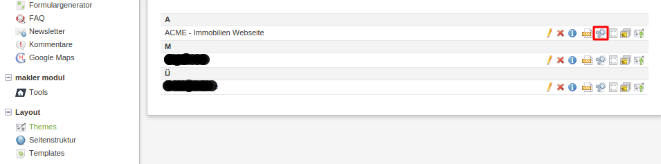
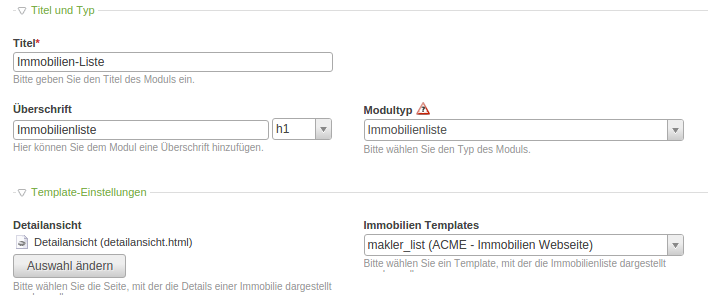
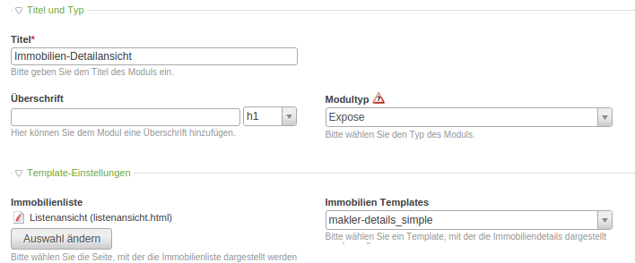

# Einrichtung

### Module anlegen

* 
unter Backend-Module **Layout** den Punkt **Themes** wählen und für das Theme Ihrer Webseite das Icon **Die Frontend-Module des Themes ID … bearbeiten** auswählen

* 
dort **Neues Modul** auswählen – für die Listenansicht
 * Titel für die **Immobilienliste** eingeben und bei Modultyp unter **MaklerModulMplus**
den Eintrag Immobilienliste auswählen
 * bei **Detailansicht** die entsprechende Seite auswählen
 * bei **Immobilien** Templates den Eintrag **makler_list** wählen
 * **Speichern und schliessen** klicken

* 
noch einmal **Neues Modul** auswählen – für die Detailansicht
 * Titel für die Detailansicht eingeben und bei Modultyp unter **MaklerModulMplus**
den Eintrag **Expose** auswählen
 * bei **Immobilien Templates** den Eintrag **makler_details_simple** oder **makler_details_extended** wählen (das extended-Template beinhaltet mehr Felder und den Energiepass mit allen Energieangaben)
 * bei **Immobilienliste** die bereits angelegte Seite, die später die Immobilienliste enthalten soll, auswählen
 * ab Version 1.6.0 kann optional ein eigenes **Platzhalter-Bild** gesetzt werden, falls beim Immobilienobjekt in der Detailansicht kein Bild hinterlegt ist. Wird kein Platzhalter-Bild ausgewählt und das Immobilienobjekt besitzt kein Bild, wird ein moduleigenes Platzhalter-Bild dargestellt. 
 * **Speichern und schliessen** klicken

* 
unter Backend-Module **Inhalte** den Punkt **Artikel** wählen und zwei **neue Artikel** für die **Listenansicht** und
**Detailansicht** in den entsprechenden Seiten anlegen und die **neu angelegten Module** einbinden
* 
bei dem jeweiligen Artikel das Icon **Artikel ID … bearbeiten** wählen
 * rechts von den Artikeldaten das Icon **neues Element oben erstellen** klicken
 * bei Elementtyp den Eintrag „Modul“ wählen
 * die Ansicht ändert sich; bei Modul für die Listenansicht **Listenansicht(ID...)**
und für die Detailansicht **Detailansicht (ID...)** wählen
 * **Speichern und schliessen** klicken