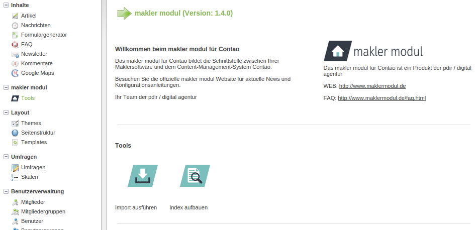

# Import starten

Es gibt die Möglichkeit den Import bei dem Backend-Modul **makler modul** über **Tools** und **Import ausführen** manuell auszuführen.

Oder man kann den Import über den Aufruf folgender URL im Browser ausführen.
**http://www.ihr-domainname.de/system/modules/makler_modul_mplus/assets/cron.php**

**ihr-domainname** durch **ihre Domain** ersetzen.

Wenn Sie nun die Listenansicht aufrufen, sollte Sie die importierten Objekte aufgelistet sehen. Durch einen Klick auf das Bild eines Objektes gelangen Sie zur Detailansicht.