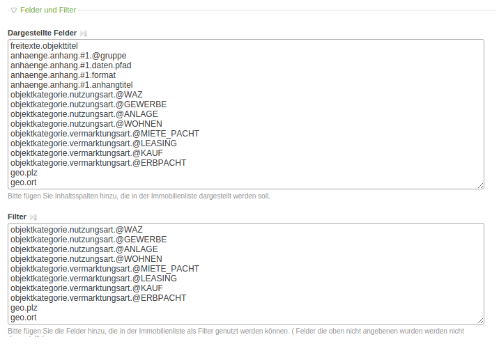

# Konfiguration der Listenansicht

Wie Sie sicher schon bemerkt haben, wurden bei der Einrichtung 2 Felder im Modul **Listenansicht**
ignoriert: **Dargestellte Felder** und **Filter**. Wenn diese beiden Felder leer sind, dann wird die Standardkonfiguration
wirksam, deren Auswirkung Sie aktuell sehen, wenn Sie die Listenansicht aufrufen.

Wie der Name **Dargestellte** Felder bereits andeutet, steuert dieses Eingabefeld, welche Daten in der Listenansicht bereit gestellt werden sollen. Angenommen Sie möchten nur das erste Objektbild zusammen mit dem Titel anzeigen, dann tragen Sie bitte folgendes in das Feld **Dargestellte Felder** ein:

```
freitexte.objekttitel
anhaenge.anhang.#1.@gruppe
anhaenge.anhang.#1.daten.pfad
anhaenge.anhang.#1.format
anhaenge.anhang.#1.anhangtitel
```

**Speichern** Sie die **Einstellungen** des Moduls und rufen Sie folgende **URL** in Ihrem Browser auf: **http://www.ihre-domain.de/system/modules/makler_modul_mplus/assets/indexer.php**.

Wenn Sie nun die Seite mit Ihrer Listenansicht aktualisieren, werden Sie festellen, dass der Filter verschwunden ist. Dies liegt daran, dass die Standardeinstellungen nicht mehr greifen, sobald im Feld Dargestellte Felder etwas eingetragen wurde.

Um Ihren Kunden die Filterung nach Nutzungsart, Vermarktungsart und Ort zu ermöglichen, ergänzen Sie in jeweils beiden Felder folgende Zeilen:

```
objektkategorie.nutzungsart.@WAZ
objektkategorie.nutzungsart.@GEWERBE
objektkategorie.nutzungsart.@ANLAGE
objektkategorie.nutzungsart.@WOHNEN
objektkategorie.vermarktungsart.@MIETE_PACHT
objektkategorie.vermarktungsart.@LEASING
objektkategorie.vermarktungsart.@KAUF
objektkategorie.vermarktungsart.@ERBPACHT
geo.plz
geo.ort
```

Die 2 Felder würden nun so aussehen:



**Speichern** Sie die **Einstellungen** des Moduls und rufen Sie im Backend-Modul **makler-modul** **Tools** auf und drücken auf **Index aufbauen**.<br>
Alternativ können Sie den Index auch über den Aufruf folgender URL in ihrem Browser aufbauen: **http://www.ihre-domain.de/system/modules/makler_modul_mplus/assets/indexer.php**.

Nun sollten Sie in der Listenansicht Filter-Buttons für die oben genannten Felder finden. Für jeden Wert der mindestens einmal in einem Objekt vorhanden ist, wird ein Button generiert.