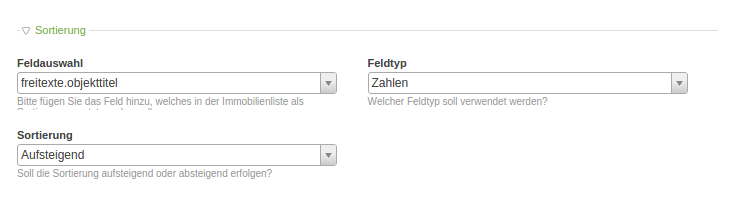
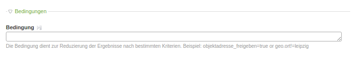

# Konfiguration der Listenansicht

Wie Sie sicher schon bemerkt haben, wurden bei der Einrichtung 2 Felder im Modul **Listenansicht**
ignoriert: **Dargestellte Felder** und **Filter**. Wenn diese beiden Felder leer sind, dann wird die Standardkonfiguration
wirksam, deren Auswirkung Sie aktuell sehen, wenn Sie die Listenansicht aufrufen.

Wie der Name **Dargestellte** Felder bereits andeutet, steuert dieses Eingabefeld, welche Daten in der Listenansicht bereit gestellt werden sollen. Angenommen Sie möchten nur das erste Objektbild zusammen mit dem Titel anzeigen, dann tragen Sie bitte folgendes in das Feld **Dargestellte Felder** ein:

>freitexte.objekttitel 
anhaenge.anhang.#1.@gruppe 
anhaenge.anhang.#1.daten.pfad 
anhaenge.anhang.#1.format 
anhaenge.anhang.#1.anhangtitel

**Speichern** Sie die **Einstellungen** des Moduls und rufen Sie folgende **URL** in Ihrem Browser auf: **http://www.ihre-domain.de/system/modules/makler_modul_mplus/assets/indexer.php**.

Wenn Sie nun die Seite mit Ihrer Listenansicht aktualisieren, werden Sie festellen, dass der Filter verschwunden ist. Dies liegt daran, dass die Standardeinstellungen nicht mehr greifen, sobald im Feld Dargestellte Felder etwas eingetragen wurde.

Um Ihren Kunden die Filterung nach Nutzungsart, Vermarktungsart und Ort zu ermöglichen, ergänzen Sie in jeweils beiden Felder folgende Zeilen:

>objektkategorie.nutzungsart.@WAZ 
objektkategorie.nutzungsart.@GEWERBE 
objektkategorie.nutzungsart.@ANLAGE 
objektkategorie.nutzungsart.@WOHNEN 
objektkategorie.vermarktungsart.@MIETE_PACHT 
objektkategorie.vermarktungsart.@LEASING 
objektkategorie.vermarktungsart.@KAUF 
objektkategorie.vermarktungsart.@ERBPACHT 
geo.plz 
geo.ort

**Speichern** Sie die **Einstellungen** des Moduls und rufen Sie folgende **URL** in Ihrem Browser auf: **http://www.ihre-domain.de/system/modules/makler_modul_mplus/assets/indexer.php**.

Nun sollten Sie in der Listenansicht Filter-Buttons für die oben genannten Felder finden. Für jeden Wert der mindestens einmal in einem Objekt vorhanden ist, wird ein Button generiert.

### Sortierung
Sie haben die Möglichkeit Ihre Immobilien in der Listenansicht Ihrer Homepage nach einen bestimmten Feld zu sortieren.

Bei **Feldauswahl** können Sie auswählen, nach welchem Feld sortiert werden soll. 
Bei **Feldtyp** wählen Sie den Feldtyp (Zahl, Gleitkommazahl oder Text) aus. 
Bei **Sortierung** wählen Sie aus ob sie aufsteigend oder absteigend sortieren lassen wollen.

### Bedingungen

Das Feld **Bedingungen** dient zur Reduzierung der Ergebnisse nach bestimmten Kriterien. Wollen Sie z. B. nur Objekte in Leipzig angezeigt haben, können SIe hier folgendes eingeben: **geo.ort=Leipzig** (auf Groß- und Kleinschreibung achten!).

### Bildeinstellungen

...

### Paginierung

...

### Optionen

...