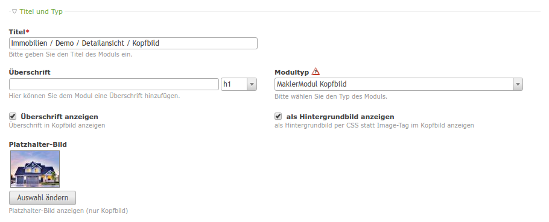
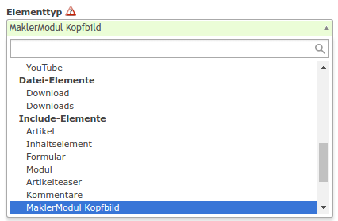

# Kopfbild mit Überschrift

Das Kopfbild kann entweder als Modul- oder Content-Element angelegt werden.

### Modul anlegen:

Unter **Themes** und **Module** im Theme Ihrer Webseite, legen Sie ein **neues Modul** an. 

Es muss der **Modultyp** **"MaklerModul Kopfbild"** ausgewählt werden. Wenn der Objekttitel als Überschrift angezeigt werden soll, muss die Option **"Überschrift auswählen"** ausgewählt werden. Alternativ können Sie auch eine **eigene Überschrift** angeben, die den Objekttitel im Kopfbild ersetzt (die Option "Überschrift anzeigen" muss ausgewählt sein). Das Kopfbild kann entweder als **normales Bild** oder als **Hintergrundbild** dargestellt werden. 

Außerdem kann ein eigener **Platzhalter** gesetzt werden, falls beim Immobilienobjekt kein Bild hinterlegt ist. Wird kein Platzhalter-Bild ausgewählt und das Immobilienobjekt besitzt kein Bild, wird ein moduleigenes Platzhalter-Bild dargestellt. 

### Content-Element anlegen:

Das Kopfbild kann auch in einem Artikel als **Content-Element** angelegt werden. Dazu wählen Sie als **Elementtyp** unter Include-Elemente **"MaklerModul Kopfbild"** aus. Beim Content-Element haben Sie genau die selben Einstellungsmöglichkeiten wie beim Modul.

