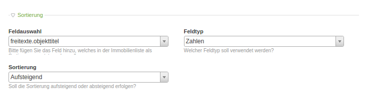
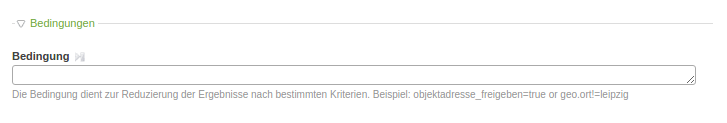
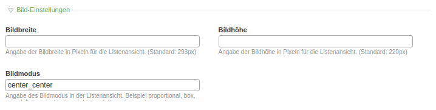
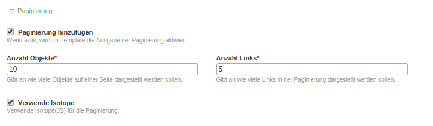
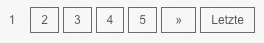
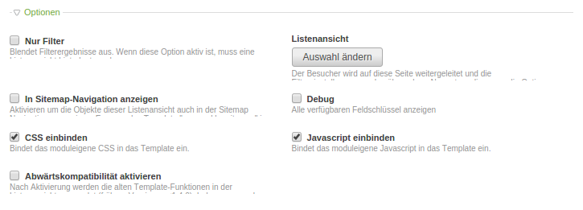

# Sortiermöglichkeiten der Listenansicht

## Sortierung

Sie haben die Möglichkeit Ihre Immobilien in der Listenansicht Ihrer Homepage nach einen bestimmten Feld zu sortieren.

Bei **Feldauswahl** können Sie auswählen, nach welchem Feld sortiert werden soll. 
Bei **Feldtyp** wählen Sie den Feldtyp (Zahl, Gleitkommazahl oder Text) aus. 
Bei **Sortierung** wählen Sie aus ob sie aufsteigend oder absteigend sortieren lassen wollen.

## Bedingungen

Das Feld **Bedingungen** dient zur Reduzierung der Ergebnisse nach bestimmten Kriterien. Wollen Sie z. B. nur Objekte in Leipzig angezeigt haben, können SIe hier folgendes eingeben: **geo.ort=Leipzig** (auf Groß- und Kleinschreibung achten!).

## Bildeinstellungen

Bei **Bildbreite** und **Bildhöhe** gibt man eine Angabe der Breite bzw. der Höhe in Pixel an. Standards sind für die Breite 293px, für die Höhe 220px.

**Bildmodus** gibt die Ausrichtung des Bildes in der Listenansicht an. Folgende Angaben sind möglich:
* 
**proportional:** 
* 
**box:**
* 
**crop:**
* 
**left_top:**
* 
**center_top:**
* 
**right_top:**
* 
**left_center:**
* 
**center_center:**
* 
**right_center:**
* 
**left_bottom:**
* 
**center_bottom:**
* 
**right_bottom:** 

## Paginierung

Bei **Anzahl der Objekte** kann man auswählen, wie viele Objekte auf einer Seite angezeigt werden sollen.

Bei **Anzahl der Links** kann man auswählen wie viele Links man in der Seitennummerierung (siehe folgendes Bild) angezeigt haben möchte. Wenn man z. B. 2 einträgt, werden im nachfolgenden Bild nur die 2 und 3 angezeigt. Die restlichen Nummern werden dann mit ... angezeigt.

**Verwende Isotope** bewirkt, dass die Elemente sich verschieben, wenn man Filter anwendet.

## Optionen

**Nur Filter** blendet alle Filterergebnisse aus. Wenn diese Option aktiv ist, muss bei **Listenansicht** eine Seite angegeben werden auf die weitergeleitet wird, die die Filtereinstellungen mit übernimmt.

Bei **In Sitemap-Navigation anzeigen** werden die Objekte dieser Listenansicht auch in der Sitemap Navigation angezeigt. Es muss das Template "nav_makler-sitemap" in den Templateeinstellungen der Sitemap-Navigation ausgewählt werden.

**Debug** zeigt alle verfügbaren Feldschlüssel an, die verwendet werden können.

**CSS einbinden** bindet das moduleigene CSS in das Template ein.

**Javascript einbinden** bindet das moduleigene Javascript ind as Template ein.

**Abwärtskompatibilität** aktivieren bedeutet, dass nach Aktivierung die alten Template-Funktionen in der Listenansicht verwendet werden (frühere Versionen <1.4.0). Der Index muss nach einer Änderung neu aufgebaut werden.